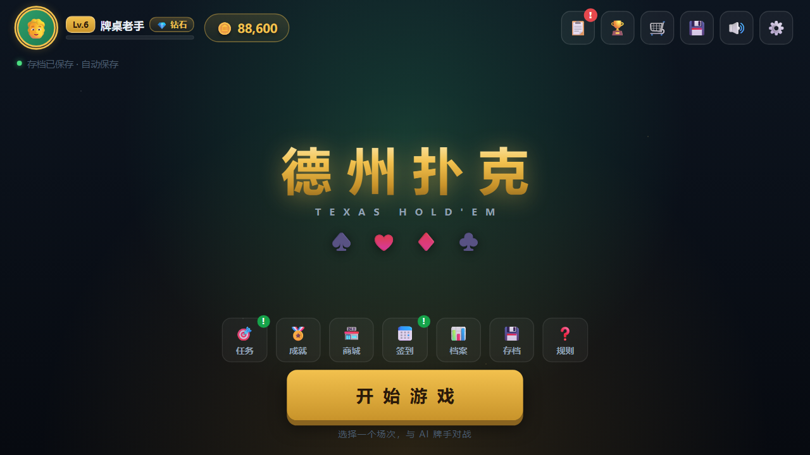
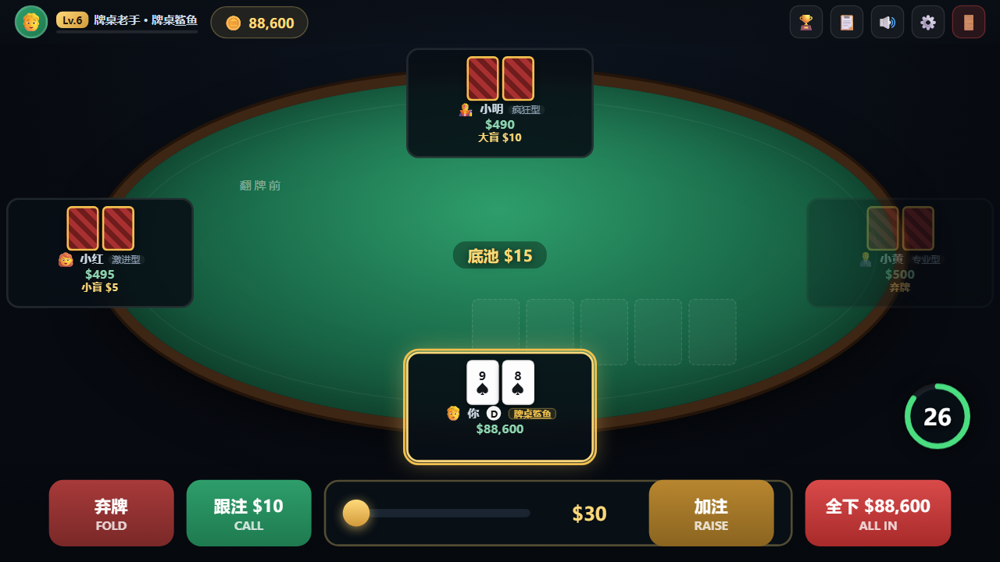
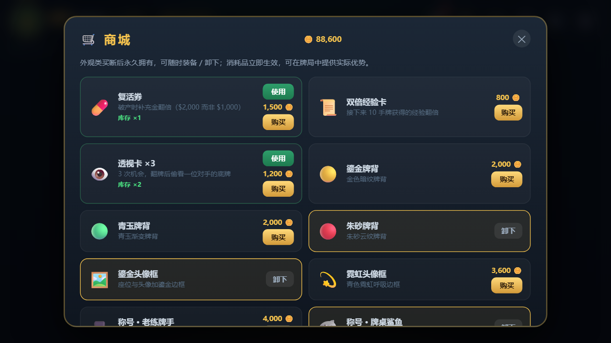
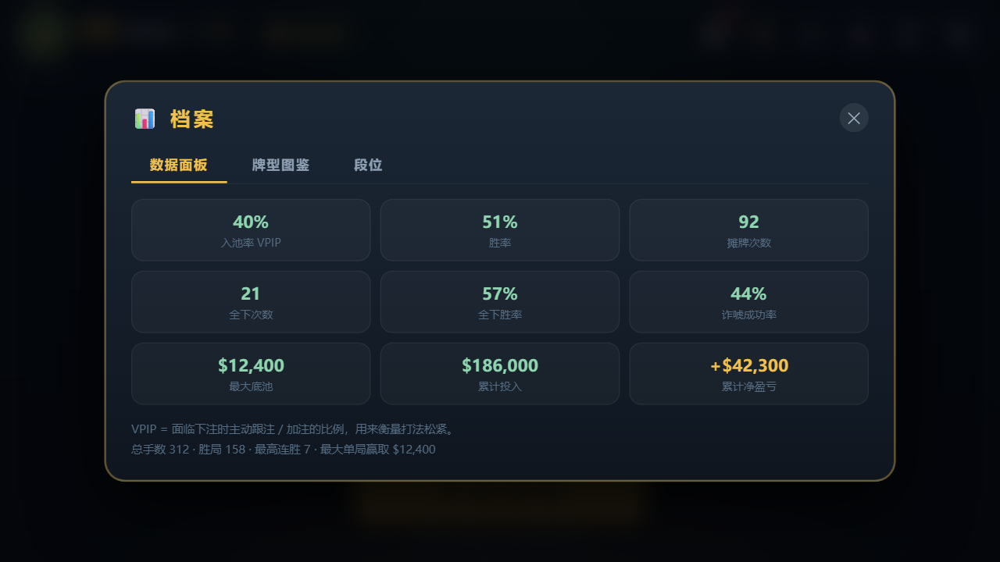
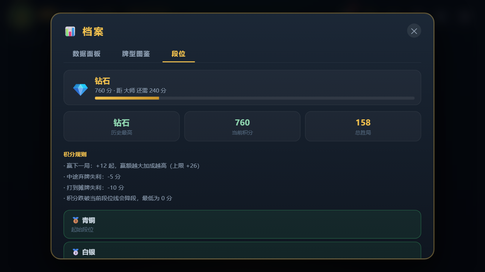
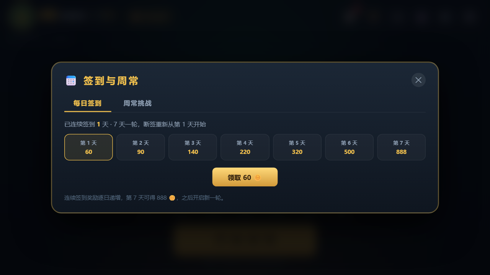
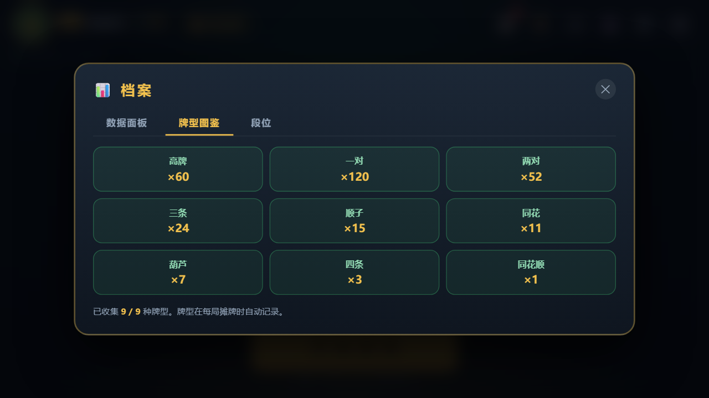
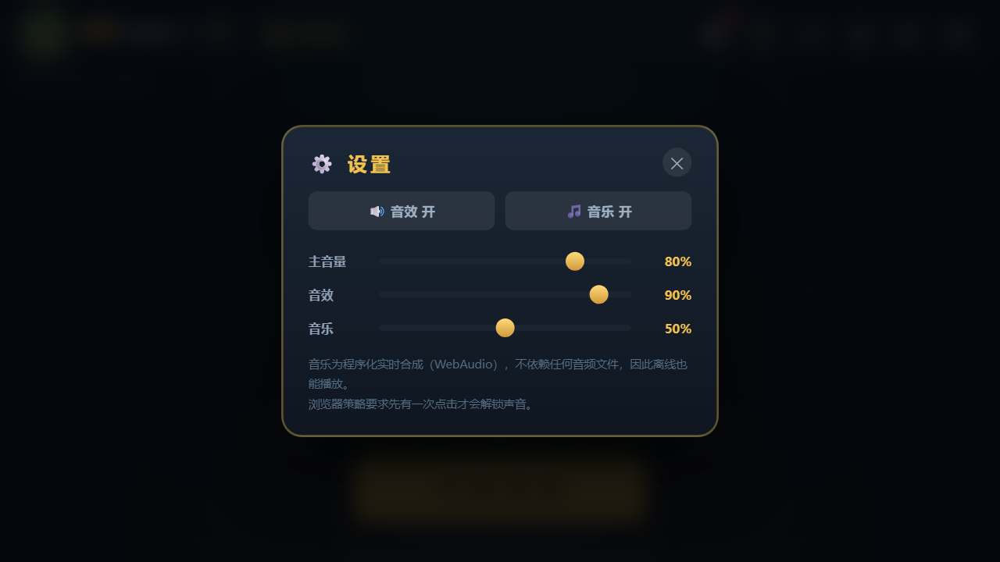

# 德州扑克 · Texas Hold'em

一个**单文件、零依赖、离线可玩**的单人德州扑克网页游戏。双击 `index.html` 就能和 3 位 AI 牌手对战，专门为「不发布、只自己娱乐」的场景打造。

> 本项目源自一段 DeepSeek 对话的续写：原对话在 `playHand` 函数中途截断。这里补全了实现、修复了若干缺陷，并继续打磨了**音频**与**游戏生态**两大块。

---

## 快速开始

```bash
# 方式一：直接双击
index.html

# 方式二：本地起个服务（推荐，存档更稳定）
python -m http.server 8000
# 浏览器打开 http://localhost:8000
```

浏览器策略要求先有一次点击才会解锁声音。

### 手机横屏

竖屏打开时会弹出「请横屏体验游戏」，点 **🔄 强制横屏** 后按这个顺序处理：

1. **先请求全屏**（Android 要求先进全屏，方向锁定才会被接受）
2. **再锁定方向** `screen.orientation.lock('landscape')`
3. **两条都不可用时**（例如 iPhone：`screen.orientation.lock` 与 `requestFullscreen` 都不存在）
   → 用 **CSS 把舞台旋转 90°**，此时把手机**横过来拿（顶部朝左）**即可正常游玩

第 3 步是关键兜底：即使系统不支持方向锁定，画面也会填满整屏，
而不是缩成竖屏中间的一小块（实测缩放从 0.41 提升到 0.72，画面大约大 78%）。

- 选择会记在 `localStorage`，下次打开自动生效
- 设备真的转成横屏后会自动取消 CSS 旋转，回到常规缩放
- 系统若锁定竖屏，转回竖屏时会自动恢复伪横屏

---

## 截图

| 大厅 | 牌桌 |
|---|---|
|  |  |

| 商城（金币出口） | 数据面板 |
|---|---|
|  |  |

| 段位排位 | 每日签到 |
|---|---|
|  |  |

| 牌型图鉴 | 设置（音量） |
|---|---|
|  |  |

更多：`docs/screenshots/` 下还有场次选择、任务、成就、存档、规则共 13 张。

---

## 功能一览

### 牌局核心
- 完整的德州扑克规则：翻牌前 / 翻牌圈 / 转牌圈 / 河牌圈四轮下注
- 牌型评估从 7 张中选最佳 5 张（`C(7,5)=21` 组合枚举），支持 A2345 轮子顺
- **完整侧池（Side Pot）分层结算**：按 `totalBet` 逐层分配，全下不等额时公平分池，弃牌者的筹码作死钱瓜分
- 小盲 / 大盲 / 庄家位轮转，加注最小单位随场次变化

### AI 对手（6 种性格）
| 角色 | 性格 | 解锁 | 特点 |
|---|---|---|---|
| 小红 | 激进型 | Lv.1 | 爱加注，偶尔诈唬 |
| 小蓝 | 保守型 | Lv.1 | 只玩好牌，很少诈唬 |
| 小绿 | 平衡型 | Lv.1 | 按牌力理性决策 |
| 小明 | 疯狂型 | Lv.3 | 狂野激进，频繁诈唬 |
| 小黄 | 专业型 | Lv.5 | 读牌精准，会慢玩埋伏 |
| 赌神 | BOSS | Lv.8 | 全能高手，会针对你 |

AI 具备**心理博弈**能力：记录你的历史动作（弃牌 / 跟注 / 加注比例），
- 你经常弃牌 → 它们提高诈唬频率
- 你经常加注 → 它们收紧范围
- 结合底池赔率（pot odds）、牌面质地（同花听牌 / 顺子听牌 / 公对面）、慢玩（slow play）与情绪波动（tilt）

### 场次与难度
| 场次 | 盲注 | 带入 | 入场费 | 思考时间 | 加注下限 | AI |
|---|---|---|---|---|---|---|
| 🌱 简单 | 5 / 10 | $500 | 免费 | 30s | ≥10 | 温和 |
| 🎯 普通 | 50 / 100 | $5,000 | $200 | 20s | ≥100 | 平衡 |
| 🔥 困难 | 250 / 500 | $20,000 | $1,000 | 15s | ≥500 | 激进 |
| 👑 冠军 | 500 / 1000 | $100,000 | $5,000 | 12s | ≥1,000 | 顶级 |

---

## 音频系统

### 🎵 想换真实音乐？丢文件就行（推荐路线）

在 `index.html` 同级建一个 **`assets/`** 目录，把音频文件丢进去，**刷新即生效，不用改代码**：

| 文件名 | 用在哪 |
|---|---|
| `bgm-lobby.mp3` | **主界面 / 大厅** |
| `bgm-table.mp3` | **牌桌默认** |
| `bgm-easy.mp3` / `bgm-normal.mp3` / `bgm-hard.mp3` / `bgm-champion.mp3` | 对应场次（缺省回落 `bgm-table`） |
| `sfx-deal.mp3` / `sfx-chip.mp3` / `sfx-win.mp3` / `sfx-lose.mp3` | 对应音效（缺省用合成音） |

- 支持 `mp3` / `ogg` / `m4a`，主界面与牌桌是**两套独立曲子**，进游戏自动切换
- 文件缺失或解码失败 → **自动回落到内置合成引擎**，永远不会没声音
- 设置面板会实时显示「当前 BGM 来源」
- ⚠️ `assets/` 已被 `.gitignore` 排除（只保留 `assets/README.md`），
  **放这里的音频不会进 Git、不会上 GitHub Pages**，仅供本机使用
- 详见 `assets/README.md`；若要分发，请换成 CC0 / 免版税素材

> 顺带回答一个常见问题：**不能直接打包欢乐斗地主的音频**。那是腾讯的版权资产，
> 放进公开仓库和 Pages 站点属于公开分发。自用可以放 `assets/`（不会进仓库），分发请换有授权的素材。

### 内置合成 BGM（无文件时自动启用）
用 WebAudio **实时合成**，不依赖任何音频文件，离线可播。

- **5 首曲目**：大厅（慢速摇摆爵士，电钢 + 刷子鼓）、简单场（明亮轻快）、普通场（稳定律动）、困难场（小调紧张）、冠军场（和声小调压迫）
- 编曲从 4 小节循环升级为 **8 小节 A/B 两段**，避免听腻
- **真鼓组**：底鼓（150→52Hz 滑音）、军鼓（噪声带通 + 音体）、踩镲、叮叮镲，5 套鼓型（brush / light / basic / drive / heavy）
- **电钢 Rhodes**：用 **FM 合成**（载波 + 2 倍频调制器）做出钟琴质感，而不是干瘪的正弦音
- **贝斯**走 1 / 2& / 3 / 4& 的走动低音；**铺底 pad** 为 detune 双锯齿 + 缓慢滤波扫动
- **混响**：ConvolverNode + 程序生成的脉冲响应（带 8ms 预延迟），这是音质提升最大的一项
- **人性化**：每个音符有轻微的时值抖动与力度变化，避免机械感
- **lookahead 调度器**：25ms 轮询、提前 150ms 排程；**时钟跳变保护**防止切后台回来时补发海量音符（有单元测试覆盖）

### 音效（16 种，全部合成）
| 类别 | 音效 |
|---|---|
| 牌局 | `shuffle` 洗牌、`deal` 发牌、`flip` 翻牌、`chip` 筹码、`chipstack` 筹码堆叠 |
| 行动 | `check` 过牌、`fold` 弃牌、`allin` 全下重击、`timeout` 超时 |
| 反馈 | `win` 胜利、`lose` 失败、`levelup` 升级、`rankup` 升段、`achievement` 成就、`coin` 金币、`click` 点击 |
| 紧张 | `tick` 倒计时滴答、`heartbeat` 心跳（≤3 秒时触发 + 屏幕红边） |

拟真质感音（洗牌、筹码堆叠）用**噪声 + 带通滤波**合成，不是单纯正弦音。

### 音频设置
- 「主音量 / 音效 / 音乐」三条独立滑块，实时生效并记忆到存档
- 音效与音乐各有独立开关
- 音频图：`源 → [sfxGain / musicGain] → masterGain → destination`，
  另有 `musicSend / sfxSend` 两路送入混响卷积器，音乐总线压低到 34% 避免盖住音效

---

## 游戏生态

### 🏅 段位排位
青铜 → 白银 → 黄金 → 铂金 → 钻石 → 大师 → 传奇。

| 行为 | 积分 |
|---|---|
| 赢下一局 | +12 起，赢额越大加成越高（上限 +26） |
| 中途弃牌失利 | −5 |
| 打到摊牌失利 | −10 |
| 积分跌破段位线 | 降段（最低 0 分，历史最高段位永久保留） |

首次晋升每段发放一次奖励（500 → 20,000 🪙），升段时有专属音效与横幅提示。

### 🛒 商城与道具（金币出口）
11 件商品，分两类：

| 类型 | 商品 | 作用 |
|---|---|---|
| 消耗品 | 复活券 | 破产时补充金翻倍（$2,000 而非 $1,000） |
| 消耗品 | 双倍经验卡 | 接下来 10 手经验翻倍 |
| 消耗品 | 透视卡 ×3 | 翻牌后公开一位对手的底牌（**真实信息优势**） |
| 外观 | 鎏金 / 青玉 / 朱砂牌背 | 改变所有背面牌的花纹，买断后可随时装备 / 卸下 |
| 外观 | 鎏金 / 霓虹头像框 | 大厅头像与座位牌桌加边框 |
| 外观 | 老练牌手 / 牌桌鲨鱼 / 东方巨龙 | 名字后显示称号，牌桌上可见 |

### 📅 每日签到 + 周常挑战
- **签到**：7 天一轮，奖励递增 60 → 90 → 140 → 220 → 320 → 500 → **888** 🪙，断签重新从第 1 天开始
- **周常**：每周一 0 点刷新 6 项挑战（30 手牌局 / 赢 10 局 / 全下 3 次 / 诈唬成功 3 次 / 3 次同花以上 / 达成 3 连胜），奖励 700 ~ 1,200 🪙

### 📊 数据面板 + 牌型图鉴
- **9 项统计**：入池率 VPIP、胜率、摊牌次数、全下次数、全下胜率、诈唬成功率、最大底池、累计投入、累计净盈亏
- **牌型图鉴**：9 类牌型（高牌 → 同花顺）各记录达成次数，摊牌时自动收集

### 任务与成就
- 21 项新手任务（全清约 8,250 🪙）、9 选 5 的每日任务、16 项成就（含皇家同花顺、五连胜、战胜赌神）
- 三处红点提醒（大厅顶栏 / 快捷入口 / 任务页签），签到与周常另有独立红点

### 多存档
- **3 个独立存档槽**，各自记录金币、等级、段位、成就、任务、背包与统计
- 支持新建 / 切换 / 删除（删除有二次确认）
- 全程自动保存到 `localStorage`，大厅实时显示保存状态
- **存档版本迁移**：`v10 → v11` 会自动补齐新字段，老存档不会崩、金币等级不丢

---

## 测试

仓库带两套自动化测试，无需安装任何依赖（第二套用到的 `jsdom` 若缺失会自动跳过）。

```bash
# 1) 逻辑与对局测试
node tests/test.js            # 默认 120 手，简单场
node tests/test.js 200 hard   # 200 手，困难场
node tests/test.js 150 champion
```

覆盖内容（**188 项断言**）：
- 牌型评估 12 类边界（皇家同花顺、轮子顺、四条、葫芦…）
- `bestHand` 与朴素 21 组合枚举 400 次随机一致性比对
- 侧池分配 4 个场景（主池/边池拆分、弃牌死钱、平分零头、三人同牌力）
- 端到端自动点击对局 **N 手**，断言：无运行时异常、**每手筹码总量守恒**、底池清零、加注/全下/弃牌路径全覆盖
- 破产结算流程、倒计时超时回调、多存档增删、`localStorage` 持久化
- **段位**：升降段、奖励发放、积分不为负、历史最高保留
- **签到**：连续天数、奖励档位循环、断签重置、不可重复领取
- **周常**：周键计算（周日归属上一周一）、进度累加、领取校验
- **商城**：购买扣费、外观不可重复购买、金币不足拦截、装备/卸下、消耗品使用与库存耗尽
- **图鉴与统计**：计数累加、解锁数量、比例计算
- **BGM**：曲目数据完整性、音名表精度（A4 = 440Hz）、以及用**可控时钟的假 AudioContext** 驱动调度器，验证 8 秒内调度 40+ 音符 / 15+ 打击，并断言时钟跳变 30 秒不会补发海量音符
- **存档迁移**：v10 老档补齐 v11 字段且保留金币 / 等级
- **音频接管层**：外置文件缺失时必须回落合成、来源标注不得谎报为「外置」
- **发牌动画**：手牌必须完全静止、桌面牌只在首次亮出时播一次、重复渲染不重播
- **横屏适配**：触摸识别、竖屏提示、强制横屏后的 CSS 旋转兜底、旋转缩放显著大于竖排、转横后取消旋转、记忆与恢复

```bash
# 2) 真实 DOM 冒烟测试（需要 jsdom）
NODE_PATH=<node_modules 路径> node tests/dom.test.js
```

覆盖内容（**99 项断言**）：HTML 结构完整性、脚本无未捕获错误、大厅→场次→牌桌全流程点击、
商城/档案/图鉴/段位/签到/设置面板渲染与交互、存档落盘、
**发牌途中离桌的回归测试**，以及**预置 v10 老存档**验证迁移 + 商城购买/装备/消耗品链路。

最近一次运行结果：

```
tests/test.js    → 通过 188 / 失败 0   （easy / normal / hard / champion 四档均通过）
tests/dom.test.js → 通过 99 / 失败 0
```

---

## 项目结构

```
dezhou/
├── index.html              # 全部游戏代码（HTML + CSS + JS，约 4700 行）
├── assets/
│   └── README.md           # 放你自己的 BGM / 音效（其余内容被 .gitignore 排除）
├── tests/
│   ├── test.js             # 逻辑 + 端到端对局 + 新系统 + BGM 调度器测试
│   ├── dom.test.js         # jsdom 真实 DOM 冒烟测试
│   └── extract.js          # 从 index.html 抽取 JS 做语法检查
├── docs/screenshots/       # 14 张界面截图（含手机伪横屏）
└── .gitignore
```

---

## 实现要点

| 模块 | 说明 |
|---|---|
| `evaluate5(cards)` | 单组 5 张牌评估，返回可比较数组 `[类别, 决胜值...]` |
| `bestHand(cards)` | 7 选 5 递归枚举取最大值 |
| `distributePot()` | 侧池分层分配：取最小投入额为一层，层内牌力最高者分得该层 |
| `bettingRound(startIdx)` | async 下注轮循环，人类输入用 Promise 挂起 |
| `getAction(p)` | 人类返回 Promise（配倒计时），AI 延迟后返回 `aiDecide` |
| `aiDecide(p)` | 按性格 + 底池赔率 + 牌面质地 + 对手画像决策 |
| `Music` | lookahead 调度器 + 和声/贝斯/旋律/打击四轨合成 |
| `sfx(name)` | 振荡器 + 噪声带通滤波合成的 16 种音效 |
| `Timer` | `requestAnimationFrame` 驱动的倒计时圆环 |
| `addCoins` / `spendCoins` | 金币收支统一入口，同时同步牌桌筹码 |
| `migratePlayer(p)` | 存档版本迁移，补齐缺失字段 |

## 与原始对话的差异

续写过程中修复了原设计中的若干问题：

1. **发牌循环缺少中止检查**：离桌时 `G.players` 被清空，发牌循环仍继续执行导致 `undefined.hole` 崩溃 → 已加 `G.active` 与元素存在性守卫
2. **开局瞬间闪现「下一手」按钮**：`startGame` 中 `handOver` 初值为 `true`，首帧渲染出了结算按钮 → 改为 `false` 并让底栏显示「正在发牌」
3. **成就 / 任务奖励与牌桌筹码脱节**：奖励直接加到 `player.coins` 而牌桌用的是 `G.players[0].chips`，导致筹码凭空消失 → 统一走 `addCoins()` 双写
4. **`finishHand` 空数组越界**：离桌后结算会对 `undefined` 取 `_v` → 已加早退守卫
5. **BGM 时钟跳变**：音频时钟大幅跳跃时会一次性补发大量音符节点导致卡顿 → 加重新对齐与 64 步上限
6. **座位卡片高度不足**：叠加称号后玩家自己的筹码行被裁切 → 座位高度 82 → 106px 并压缩内部行高
7. **难度卡片锁定态文字与锁图标重叠**、**任务面板默认停在每日任务** → 已调整样式与默认页签
8. **发牌时所有人的手牌都在动**：`seatHTML` 里 `idx === 0` 给每个座位第 1 张牌加了 `deal`，而 `renderTable` 每次都重建 `innerHTML` → 动画被反复重播。现改为手牌永不播动画、桌面牌只在首次亮出时播一次

## License

个人娱乐项目，随意取用。
