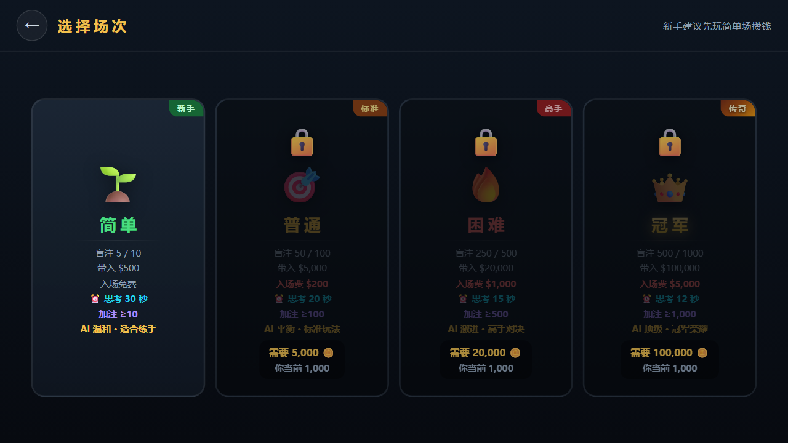
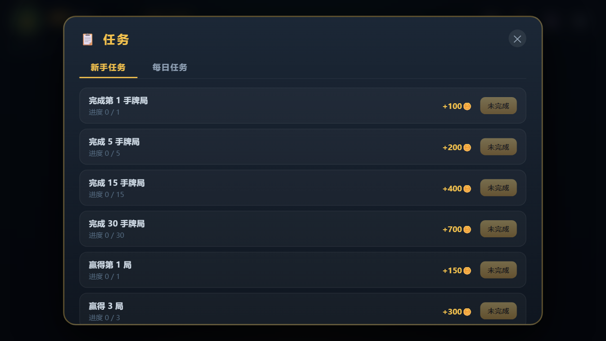
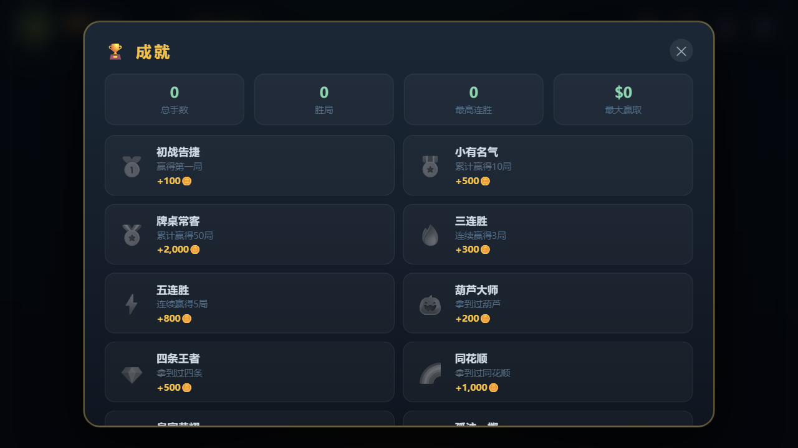
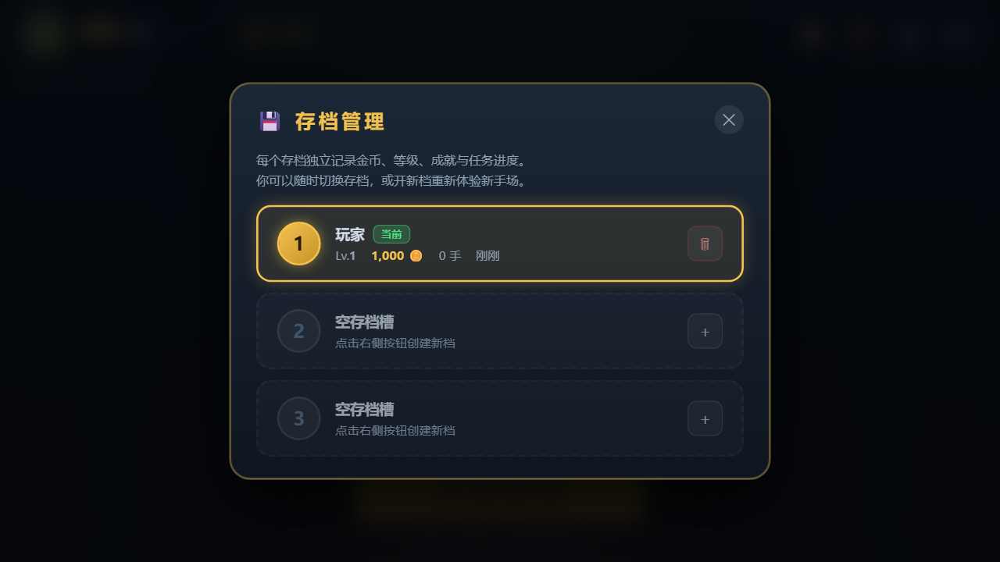

# 德州扑克 · Texas Hold'em

一个**单文件、零依赖、离线可玩**的单人德州扑克网页游戏。双击 `index.html` 就能和 3 位 AI 牌手对战，专门为「不发布、只自己娱乐」的场景打造。

> 本项目源自一段 DeepSeek 对话的续写：原对话在 `playHand` 函数中途截断，这里把实现补全、跑通测试并整理成仓库。

---

## 快速开始

```bash
# 方式一：直接双击
index.html

# 方式二：本地起个服务（推荐，存档更稳定）
python -m http.server 8000
# 浏览器打开 http://localhost:8000
```

手机端请横屏游玩，竖屏时会提示「强制横屏」。

---

## 截图

| 大厅 | 牌桌 |
|---|---|
|  |  |

| 选择场次 | 任务系统 |
|---|---|
|  |  |

| 成就 | 多存档 |
|---|---|
|  |  |

---

## 功能一览

### 牌局核心
- 完整的德州扑克规则：翻牌前 / 翻牌圈 / 转牌圈 / 河牌圈四轮下注
- 牌型评估从 7 张中选最佳 5 张（`C(7,5)=21` 组合枚举），支持 A2345 轮子顺
- **完整侧池（Side Pot）分层结算**：按 `totalBet` 逐层分配，全下不等额时公平分池，弃牌者的筹码作死钱瓜分
- 小盲 / 大盲 / 庄家位轮转，加注最小单位随场次变化

### AI 对手（6 种性格）
| 角色 | 性格 | 解锁 | 特点 |
|---|---|---|---|
| 小红 | 激进型 | Lv.1 | 爱加注，偶尔诈唬 |
| 小蓝 | 保守型 | Lv.1 | 只玩好牌，很少诈唬 |
| 小绿 | 平衡型 | Lv.1 | 按牌力理性决策 |
| 小明 | 疯狂型 | Lv.3 | 狂野激进，频繁诈唬 |
| 小黄 | 专业型 | Lv.5 | 读牌精准，会慢玩埋伏 |
| 赌神 | BOSS | Lv.8 | 全能高手，会针对你 |

AI 具备**心理博弈**能力：记录你的历史动作（弃牌 / 跟注 / 加注比例），
- 你经常弃牌 → 它们提高诈唬频率
- 你经常加注 → 它们收紧范围
- 结合底池赔率（pot odds）、牌面质地（同花听牌 / 顺子听牌 / 公对面）、慢玩（slow play）与情绪波动（tilt）

### 场次与难度
| 场次 | 盲注 | 带入 | 入场费 | 思考时间 | 加注下限 | AI |
|---|---|---|---|---|---|---|
| 🌱 简单 | 5 / 10 | $500 | 免费 | 30s | ≥10 | 温和 |
| 🎯 普通 | 50 / 100 | $5,000 | $200 | 20s | ≥100 | 平衡 |
| 🔥 困难 | 250 / 500 | $20,000 | $1,000 | 15s | ≥500 | 激进 |
| 👑 冠军 | 500 / 1000 | $100,000 | $5,000 | 12s | ≥1,000 | 顶级 |

### 成长系统
- **新手任务 21 项**：覆盖手数 / 胜局 / 加注 / 全下 / 诈唬 / 各牌型达成，全部完成共 **8,250 🪙**
- **每日任务**：从 9 项任务池中随机抽 5 项，每日 0 点刷新
- **成就 16 项**：含皇家同花顺、五连胜、战胜赌神等，共 18,000+ 🪙
- **等级与经验**：每手 +10 起，胜局 / 赢额加成；等级解锁更强 AI 与更高场次
- 三处红点提醒（大厅顶栏 / 快捷入口 / 任务页签）

### 多存档
- **3 个独立存档槽**，各自记录金币、等级、成就、任务进度与统计
- 支持新建 / 切换 / 删除（删除有二次确认）
- 全程自动保存到 `localStorage`，大厅实时显示保存状态
- 金币破产后可「领取补充金」或换新档重玩新手场

### 界面与体验
- 单文件 HTML，960×540 基准画布等比缩放，适配桌面与移动端
- 行动倒计时圆环（≤6s 转黄、≤3s 转红并伴随屏幕红边与心跳音）
- 超时自动过牌 / 弃牌
- 纯 WebAudio 合成音效，无外部资源
- 桌面端键盘快捷键：`F` 弃牌 / `C` 跟注或过牌 / `R` 加注 / `A` 全下

---

## 测试

仓库带两套自动化测试，无需安装任何依赖（第二套用到的 `jsdom` 若缺失会自动跳过）。

```bash
# 1) 逻辑与对局测试：牌型评估、侧池分配、端到端自动对局
node tests/test.js            # 默认 120 手，简单场
node tests/test.js 200 hard   # 200 手，困难场
```

覆盖内容：
- 牌型评估 12 类边界（皇家同花顺、轮子顺、四条、葫芦…）
- `bestHand` 与朴素 21 组合枚举 400 次随机一致性比对
- 侧池分配 4 个场景（主池/边池拆分、弃牌死钱、平分零头、三人同牌力）
- 端到端自动点击对局 **N 手**，断言：无运行时异常、**每手筹码总量守恒**、底池清零、加注/全下/弃牌路径全覆盖
- 破产结算流程、倒计时超时回调、多存档增删、`localStorage` 持久化

```bash
# 2) 真实 DOM 冒烟测试（需要 jsdom）
NODE_PATH=<node_modules 路径> node tests/dom.test.js
```

覆盖内容：HTML 结构完整性、脚本无未捕获错误、大厅→场次→牌桌全流程点击、
成就/任务/存档/规则面板渲染、存档落盘、**发牌途中离桌的回归测试**。

最近一次运行结果：

```
tests/test.js    → 通过 63 / 失败 0   （easy / normal / hard / champion 四档均通过）
tests/dom.test.js → 通过 50 / 失败 0
```

---

## 项目结构

```
dezhou/
├── index.html              # 全部游戏代码（HTML + CSS + JS，约 3000 行）
├── tests/
│   ├── test.js             # 逻辑 + 端到端对局测试
│   ├── dom.test.js         # jsdom 真实 DOM 冒烟测试
│   └── extract.js          # 从 index.html 抽取 JS 做语法检查
├── docs/screenshots/       # 界面截图
└── .gitignore
```

---

## 实现要点

| 模块 | 说明 |
|---|---|
| `evaluate5(cards)` | 单组 5 张牌评估，返回可比较数组 `[类别, 决胜值...]` |
| `bestHand(cards)` | 7 选 5 递归枚举取最大值 |
| `distributePot()` | 侧池分层分配：取最小投入额为一层，层内牌力最高者分得该层 |
| `bettingRound(startIdx)` | async 下注轮循环，人类输入用 Promise 挂起 |
| `getAction(p)` | 人类返回 Promise（配倒计时），AI 延迟后返回 `aiDecide` |
| `aiDecide(p)` | 按性格 + 底池赔率 + 牌面质地 + 对手画像决策 |
| `Timer` | `requestAnimationFrame` 驱动的倒计时圆环 |

## 与原始对话的差异

续写过程中修复了原设计中的几处问题：

1. **发牌循环缺少中止检查**：离桌时 `G.players` 被清空，发牌循环仍继续执行导致 `undefined.hole` 崩溃 → 已加 `G.active` 与元素存在性守卫
2. **开局瞬间闪现「下一手」按钮**：`startGame` 中 `handOver` 初值为 `true`，首帧渲染出了结算按钮 → 改为 `false` 并让底栏显示「正在发牌」
3. **成就 / 任务奖励与牌桌筹码脱节**：奖励直接加到 `player.coins` 而牌桌用的是 `G.players[0].chips`，导致筹码凭空消失 → 统一走 `addCoins()` 双写
4. **`finishHand` 空数组越界**：离桌后结算会对 `undefined` 取 `_v` → 已加早退守卫
5. **难度卡片锁定态文字与锁图标重叠**、**任务面板默认停在每日任务** → 已调整样式与默认页签

## License

个人娱乐项目，随意取用。
